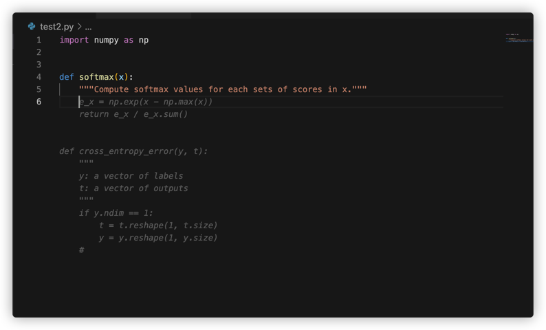

# CodeGen plugin for vscode

## 直接安装

1. 搜索安装插件


2. 私有化服务

    + [启动服务目录](./server/docker-compose.yaml)
    + 代码生成服务仓库见[fastgpt](https://github.com/LowinLi/fastgpt/tree/main/example/codegen)

3. 配置插件的服务地址


## 自行制作

+ 1.安装vsce，一个vscode插件打包工具
```bash
npm install -g vsce
```
+ 2.打包vsce插件
```bash
vsce package
```

+ 3.安装[code-insiders](https://code.visualstudio.com/insiders/)

+ 4.打开vscode命令行启动权限
    + [参考](https://blog.csdn.net/flitrue/article/details/90906578)

+ 5.启动vscode
```bash
code-insiders --enable-proposed-api lowinli.codegen-inlineCompletions # 本地未发布插件需要命令行授权
```

+ 6.安装插件


+ 7.配置服务器地址


+ 8.在线生成



---
+ 可以直接下载制作好的[vsce](https://github.com/LowinLi/code-clippy-vscode/releases/tag/v0.0.1)，跳过步骤1、步骤2